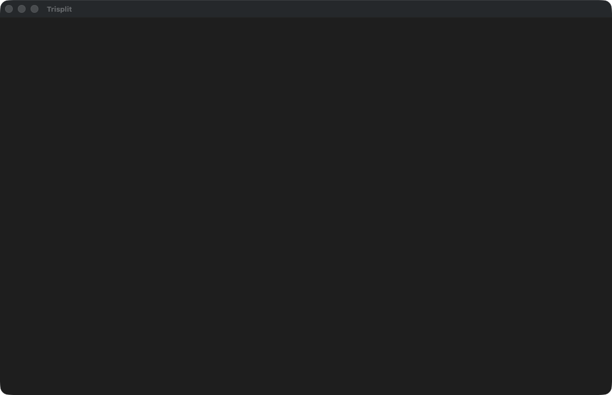

# Trisplit

Gestor de ventanas en rejilla para macOS, nativo en Swift (v2). Cada monitor tiene su
propia rejilla `cols × rows`; las apps se asignan a huecos y se recolocan con un atajo.
Varias configuraciones con nombre (Dev, Reunión, …), panel nativo con mapa del escritorio
a escala real y reordenación de monitores vía [displayplacer](https://github.com/jakehilborn/displayplacer).



## Instalación

Requisitos: macOS 13+, Command Line Tools (`swiftc`). Opcional: `brew install displayplacer`.

```bash
make install                                   # compila y copia a ~/Applications/Trisplit.app
open ~/Applications/Trisplit.app
~/Applications/Trisplit.app/Contents/MacOS/Trisplit --login-item on   # arrancar al iniciar sesión (off|status)
```

Concede **Accesibilidad** en Ajustes del Sistema → Privacidad y seguridad → Accesibilidad.

```bash
# make cert es opcional pero recomendado (firma estable, ver "Firma estable")
git clone https://github.com/pocharlies/trisplit && cd trisplit && make cert && make install
```

## Atajos

| Atajo | Acción |
|---|---|
| `⌘⌥0` | Aplicar la configuración activa |
| `⌘⌥⇧0` | Pasar a la siguiente configuración |
| `⌘⌥P` | Abrir el panel |
| `⌘⌥1…9` | Mover la ventana enfocada al hueco N (y recordarlo) |
| `⌘⌥⇧1…9` | Enfocar la app/ventana del hueco N |

URLs: `open trisplit://apply`, `trisplit://next`, `trisplit://panel`.

## Ficheros

- Estado: `~/Library/Application Support/trisplit/trisplit.json`
  (en el primer arranque se importa una copia de `~/.hammerspoon/trisplit.json`, sin tocar el original).
- Log: `~/Library/Logs/Trisplit/trisplit.log`

## CLI

| Flag | Uso |
|---|---|
| `--selftest` | Comprobaciones internas sin UI |
| `--selftest-live` | Comprobaciones contra ventanas/pantallas reales (`make live`) |
| `--login-item on\|off\|status` | Gestiona el login item (SMAppService) |

`TRISPLIT_FORCE_HOTKEYS=1` registra los atajos aunque se detecte Hammerspoon v1.

## Arquitectura

```
app/Core/     lógica pura (geometría, rejillas, estado/JSON, displayplacer, coexistencia) — testeable
app/Engine/   motor de ventanas sobre Accessibility (AX), apps, arranque
app/Shell/    AppKit: AppDelegate, menú de barra, atajos, HUD, ventana del panel
app/main.swift  entrada: CLI o app de barra de menú
panel.html    UI del panel (WKWebView), recibe estado vía window.trisplitSetState
legacy/       v1 Hammerspoon (Lua) y sus tests, sólo para rollback
```

## Tests

```bash
make unit    # Core, swiftc sin XCTest
make panel   # panel.html en WKWebView headless
make test    # ambos
make live    # selftest contra el escritorio real
```

## Migración desde v1 (Hammerspoon)

v1 queda en `legacy/` y en el tag `v1-hammerspoon`. Si Hammerspoon está en marcha con la
config v1 (`init.lua` enlazado al repo, o con `hs.hotkey.bind` + "trisplit"), v2 no registra
sus atajos para no duplicarlos. Rollback: [docs/ROLLBACK.md](docs/ROLLBACK.md).

## Firma estable (make cert)

Con firma ad-hoc cada recompilación cambia la firma y macOS retira el permiso de
Accesibilidad. Para evitarlo:

1. Una sola vez: `make cert`. Crea la identidad autofirmada `trisplit dev` en un llavero
   propio (`~/Library/Application Support/trisplit-dev/`) y lo añade a la lista de
   búsqueda del usuario (el llavero por defecto sigue siendo `login`). Es idempotente.
2. `make install`: sin `TRISPLIT_SIGN_ID`, firma con `trisplit dev`.
3. Concede **Accesibilidad** una vez más (la identidad pasa de ad-hoc a certificado).
   Las recompilaciones siguientes conservan el permiso.

`TRISPLIT_SIGN_ID` (y `TRISPLIT_KEYCHAIN`) sigue teniendo prioridad; sin identidad se
firma ad-hoc con aviso. Desinstalar: `make cert-uninstall` (quita el llavero de la lista
de búsqueda y lo borra junto con su directorio).

## Limitaciones conocidas

- Sin `make cert` (firma ad-hoc) hay que volver a conceder Accesibilidad tras cada
  recompilación; ver [Firma estable](#firma-estable-make-cert).
- Sólo ventanas del Space actual.
- Reordenar monitores requiere `displayplacer` en `/opt/homebrew/bin`.

## Licencia

MIT — ver [LICENSE](LICENSE).
